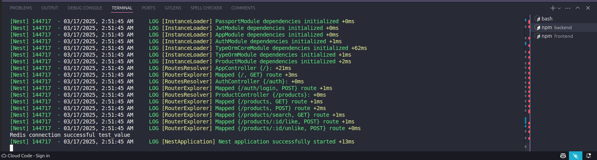
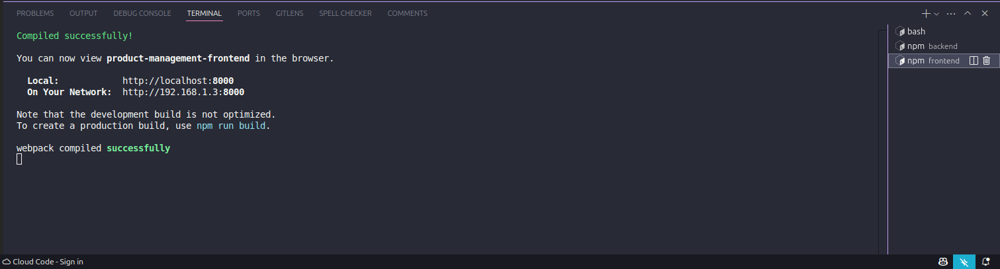

# Product Management API

## Technologies Used

- **Back-end**: NestJS
- **Main Database**: MySQL
- **Cache Database**: Redis
- **Authentication**: JWT
- **Front-end**: React

## Setup & Installation

### Prerequisites

- [Node.js](https://nodejs.org/) (v14 or higher)
- [Docker](https://www.docker.com/)

### Backend

1. Clone the repository:

   ```bash
   git clone https://github.com/your-repo/product-management-api.git
   cd product-management-api/backend
   ```

2. Install dependencies:

   ```bash
   npm install
   ```

3. Copy `.sample.env` to `.env`:

   ```bash
   cp .sample.env .env
   ```

4. Start the services using Docker Compose:

   ```bash
   docker-compose up -d
   ```

5. Seed the database:

   ```bash
   npm run seed
   ```

6. Start the application:

   ```bash
   npm run start
   ```

7. The API will be available at `http://localhost:3000`.

8. Demo:

   - **Running**:
     

   - **Database Demo Video**:
     [Watch Video](backend/src/assets/videos/databases-demo.mp4)

   - **Features Demo Video**:
     [Watch Video](backend/src/assets/videos/features-demo.mp4)

### Frontend

1. Navigate to the frontend directory:

   ```bash
   cd ../frontend
   ```

2. Install dependencies:

   ```bash
   npm install
   ```

3. Start the application:

   ```bash
   npm start
   ```

4. The frontend will be available at `http://localhost:3000`.

5. Demo:

   - **Running**:
     

   - **Frontend Demo Video**:
     [Watch Video](frontend/src/assets/videos/frontend-demo.mp4)

## API Documentation

### Authentication

#### Login

- **Endpoint**: `POST /auth/login`
- **Description**: Authenticate a user and return a JWT token.
- **Request Body**:
  ```json
  {
    "username": "string",
    "password": "string"
  }
  ```
- **Response**:
  ```json
  {
    "access_token": "string"
  }
  ```

### Products

#### Get All Products

- **Endpoint**: `GET /products`
- **Description**: Retrieve all products with pagination.
- **Query Parameters**:
  - `page`: Page number (default: 1)
  - `limit`: Number of items per page (default: 10)
- **Response**:
  ```json
  [
    {
      "id": "number",
      "name": "string",
      "price": "number",
      "category": "string",
      "subcategory": "string",
      "likes": "number"
    }
  ]
  ```

#### Create Product

- **Endpoint**: `POST /products`
- **Description**: Create a new product (authentication required).
- **Request Body**:
  ```json
  {
    "name": "string",
    "price": "number",
    "category": "string",
    "subcategory": "string"
  }
  ```
- **Response**:
  ```json
  {
    "id": "number",
    "name": "string",
    "price": "number",
    "category": "string",
    "subcategory": "string",
    "likes": "number"
  }
  ```

#### Search Products

- **Endpoint**: `GET /products/search`
- **Description**: Search products by name.
- **Query Parameters**:
  - `q`: Search query
- **Response**:
  ```json
  [
    {
      "id": "number",
      "name": "string",
      "price": "number",
      "category": "string",
      "subcategory": "string",
      "likes": "number"
    }
  ]
  ```

#### Like Product

- **Endpoint**: `POST /products/:id/like`
- **Description**: Like a product (authentication required).
- **Response**:
  ```json
  {
    "id": "number",
    "name": "string",
    "price": "number",
    "category": "string",
    "subcategory": "string",
    "likes": "number"
  }
  ```

#### Unlike Product

- **Endpoint**: `POST /products/:id/unlike`
- **Description**: Unlike a product (authentication required).
- **Response**:
  ```json
  {
    "id": "number",
    "name": "string",
    "price": "number",
    "category": "string",
    "subcategory": "string",
    "likes": "number"
  }
  ```

## Explanation of Caching, Optimization Strategies, and Like Feature

### Caching

The API uses Redis for caching to improve performance and reduce the load on the database. The `GET /products` endpoint caches the product list for 5 minutes. When products are added or likes change, the cache is invalidated to ensure data consistency.

### Optimization Strategies

1. **Pagination**: The `GET /products` endpoint supports pagination to limit the number of items returned in a single request, reducing the load on the server and improving response times.
2. **Caching**: Redis is used to cache frequently accessed data, reducing the number of database queries and improving performance.

### Like Feature

The like feature allows users to like or unlike a product. Each user can only like a product once, and the number of likes is tracked. The `POST /products/:id/like` and `POST /products/:id/unlike` endpoints handle the like and unlike functionality, respectively.
